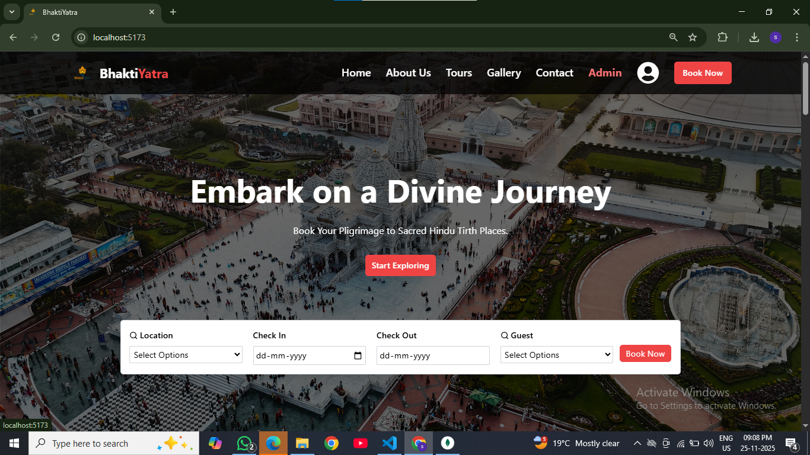
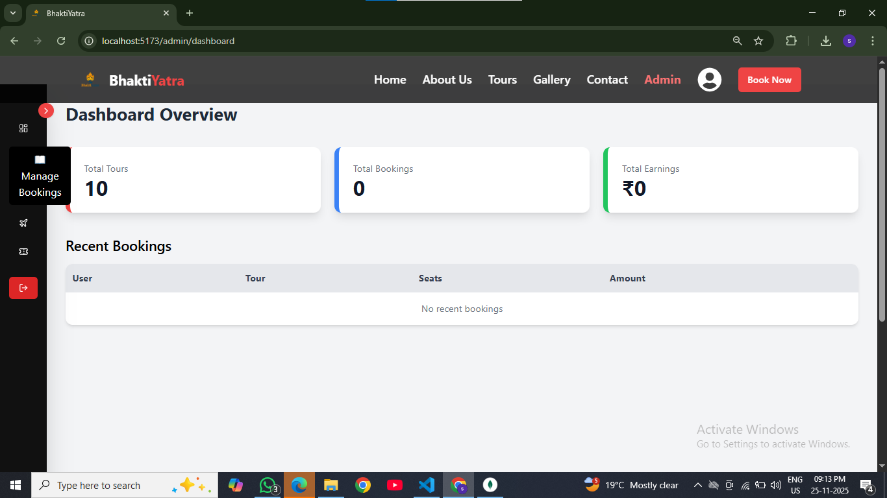

# 🕉️ BhaktiYatra – Pilgrimage Travel & Booking Platform  
A full-stack MERN travel booking system designed for pilgrimage tours across India with online payments, admin management, ticket PDF + QR code, and email booking confirmation.

---

## 🚀 Features

### 👤 User Features
✔ Browse tours & pilgrimage destinations  
✔ View tour details  
✔ Seat availability in real-time  
✔ Online payment via Razorpay  
✔ Instant ticket (PDF + QR Code) on email  
✔ My Bookings page  
✔ User authentication (JWT based)

### 🔐 Admin Features
✔ Admin dashboard with live stats  
✔ Add / Edit / Delete tours  
✔ Upload tour image  
✔ Manage seats availability  
✔ View & manage all bookings  
✔ Download customer tickets  
✔ Role-based route protection

---

## 🛠 Tech Stack

| Category | Technology |
|--------|------------|
| Frontend | React.js, TailwindCSS |
| Backend | Node.js, Express.js |
| Database | MongoDB Atlas |
| Authentication | JWT |
| Payments | Razorpay |
| Email | Nodemailer |
| Ticket | PDFKit + QRCode |
| Deployment | Vercel / Render / AWS (optional) |

---

## 📂 Folder Structure

BhaktiYatra/
│
├─ frontend/ (React)
│ ├─ src/
│ │ ├─ Components/
│ │ ├─ Pages/
│ │ ├─ api.js
│ │ ├─ App.jsx
│ │ └─ ...
│
├─ backend/ (Node / Express)
│ ├─ controllers/
│ ├─ models/
│ ├─ routes/
│ ├─ middleware/
│ ├─ uploads/
│ ├─ tickets/
│ ├─ index.js
│ └─ .env
│
└─ README.md


---

## 🔧 Environment Variables

Create `.env` inside **backend/**:

PORT=5000
MONGO_URL=...............
JWT_SECRET=################

RAZORPAY_KEY_ID=****************************
RAZORPAY_KEY_SECRET=****************

SMTP_HOST=smtp.gmail.com
SMTP_PORT=587
SMTP_USER=1****@gmail.com
SMTP_PASS=**************


---

## ▶ Run Locally

### 1️⃣ Backend
```bash
cd backend
npm install
npm run dev


##2️⃣ Frontend
cd frontend
npm install
npm run dev


💳 Payment Workflow

1. User selects seats and pays using Razorpay

2. Payment verified by backend

3. Seats reduce automatically

4. Ticket PDF generated + QR code attached

5. Ticket emailed to customer


 ## Screenshots
 | Home Page                     | Admin Dashboard                 |
| ----------------------------- | ------------------------------- |
|  |  |


⭐ Contribution

Pull Requests welcome!
Follow the standard GitHub Flow.


📄 License

This project is licensed under the MIT License — free to use and modify.


🙏 Credits

Developed with ❤️ by Shivam Singh
If this project helped you, please ⭐ the repo!
